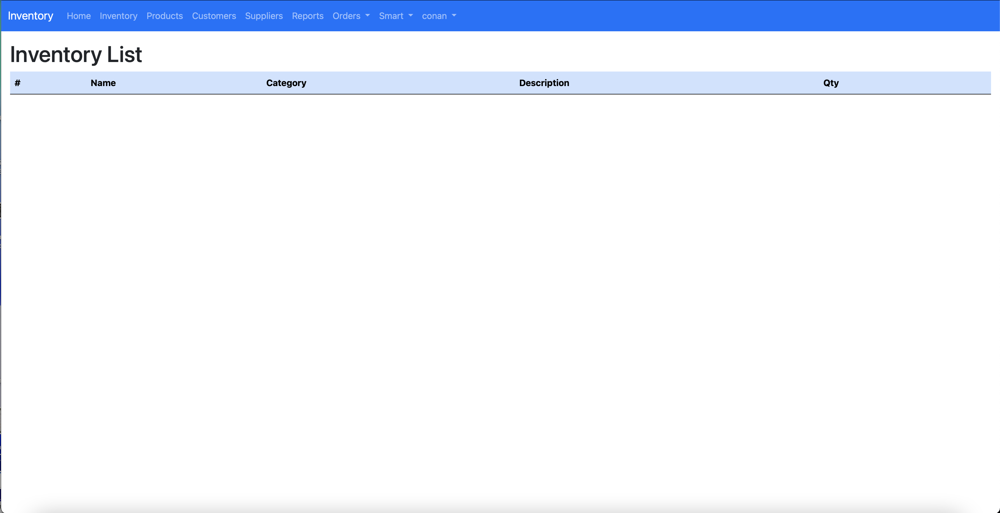

# Warehouse Inventory

 
[](https://)

## Tech Stack
### For developing Web App
 

### Database


<!-- ### Hosting
 -->

### For developing models
   

### Tools


## Features
A Webapp platform for a warehouse to manage its inventories and its operation in real-time. 
1. Use AI to help manage the inventories
2. Customer and supplier lists
3. Responsive
4. Create reports
5. Control or monitor robots in the warehouse
6. A dashboard for IoT

## Screenshots




## Clone the project
```bash
  git clone https://github.com/pangineering/warehouse-inventory.git
```

## Installation
1. Create a virual environment
```bash
  virtualenv env
  source env/bin/activate
```
2. Install Libraries
```bash
    pip3 install -r requirements.txt
```
## Run Locally
```bash
    python3 manage.py runserver
```